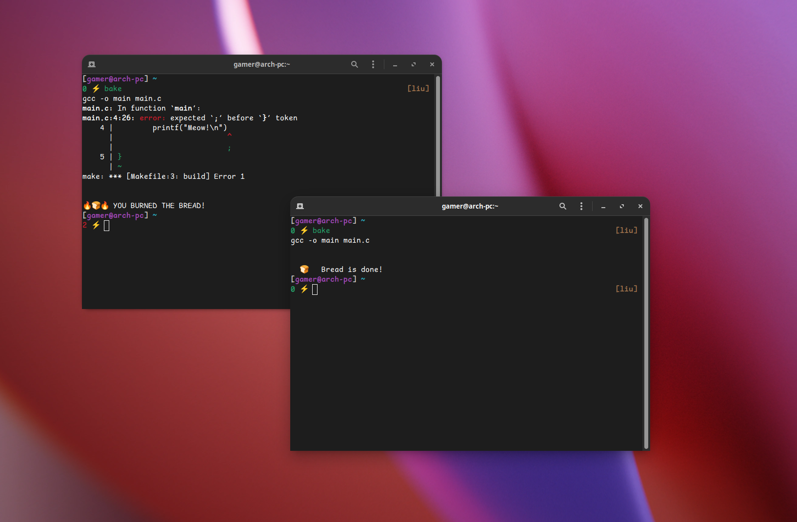
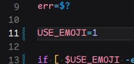

# 🍞 Bake: The most important program



## 📥 Install
```shell
git clone https://github.com/ImFstAsFckBoi/bake.git
cd bake
sh bake install

# Test that the installation worked
bake test
```
Make sure you have `~/.local/bin/` in your `$PATH` variable.

## 👨‍💻 Usage
```shell
bake [options] [target] ...
```
It's just make. But can also use a Bakefile (same as Makefile with different name).

## ⚙️ Config
Edit line 11 to `USE_EMOJI=0` to disable emojis.


